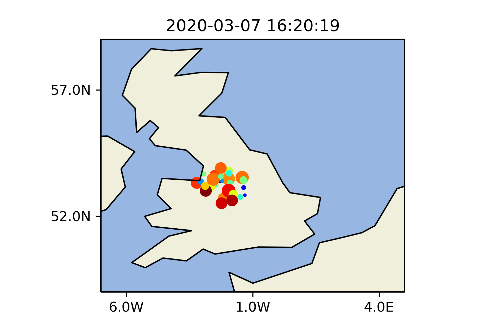

## Python

There are two Python files here, [get_flights.py](get_flights.py) and [plot_flights.py](plot_flights.py).

The `get_flights.py` file can be used to retrieve data from the [OpenSky Network API](https://opensky-network.org/apidoc/), and save the results within the specified radius of the specified location in JSON and CSV format.

The `get_flights.py` file should only require Python standard library bits.

The `plot_flights.py` file creates a simple plot of the data (read from the JSON file produced by `get_flights.py`) using the [Cartopy](https://scitools.org.uk/cartopy/docs/latest/) library.

